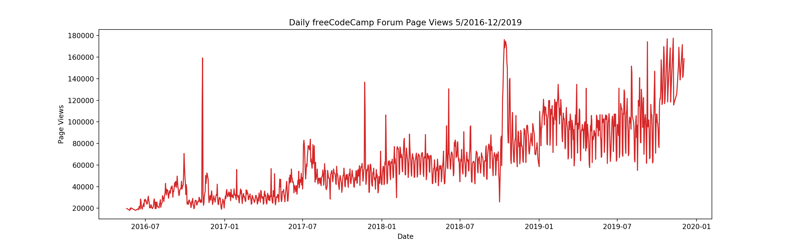
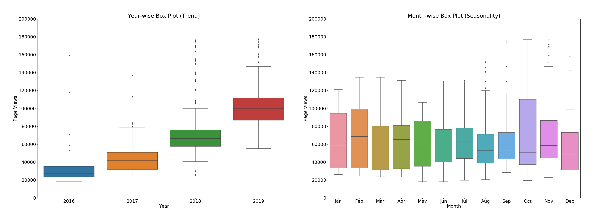

# Page View Time Series Visualizer

This is the boilerplate for the Page View Time Series Visualizer project. Instructions for building your project can be found at [freeCodeCamp.org](https://www.freecodecamp.org/learn/data-analysis-with-python/data-analysis-with-python-projects/page-view-time-series-visualizer)

---

## Detail

For this project you will visualize time series data using a **line chart**, **bar chart**, and **box plots**. You will use _Pandas_, _Matplotlib_, and _Seaborn_ to visualize a dataset containing the number of page views each day on the freeCodeCamp.org forum from 2016-05-09 to 2019-12-03. _The data visualizations will help you understand the patterns in visits and identify yearly and monthly growth._  

---

## Task

- [ ] Import **fcc-forum-pageviews.csv**  
- [ ] Set index as **date** column  
- [ ] Clean data by filterling out day that page view  
        - [ ] Page view over **Top 2.5%**  
        - [ ] Page view lower **Bottom 2.5%**  
- [ ] Draw line chart similar to "examples/Figure_1.png"
        - [ ] Title "Daily freeCodeCamp Forum Page Views 5/2016-12/2019"  
        - [ ] X label : Date  
        - [ ] Y label : Page views  
    
- [ ] Draw bar chart similar to "examples/Figure_2.png"  
        - [ ] Average page views for each month group by year  
        - [ ] Legend show month labels with Title of Months  
        - [ ] X label : Years  
        - [ ] Y label : Average Page Views  
    
- [ ] Draw box plots similar to "examples/Figure_3.png"  
        - [ ] 1st chart title : Year-wise Box Plot (Trend)  
        - [ ] 2nd chart title : Month-wise Box Plot (Seasonality)  
        - [ ] Months labels on bottom start at Jan  
        - [ ] X label :  
        - [ ] Y label :  
      

---

## Test module
