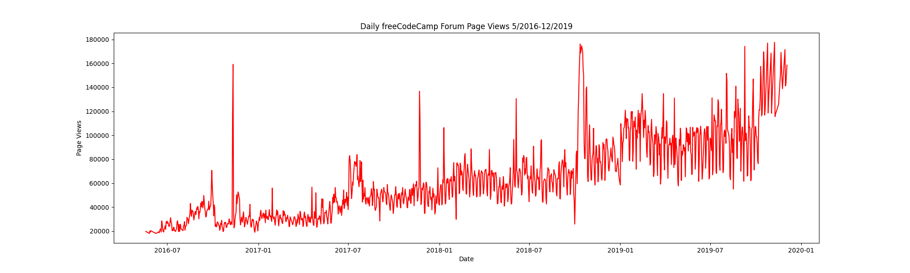
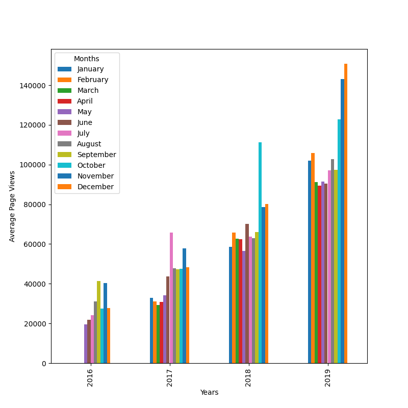
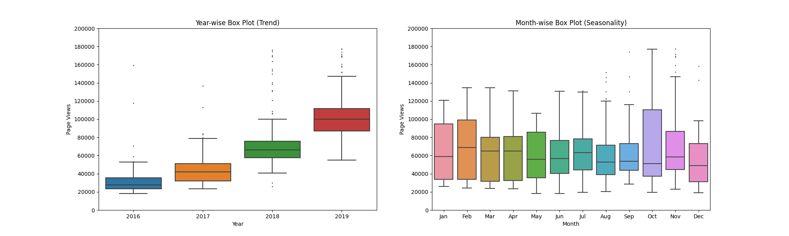
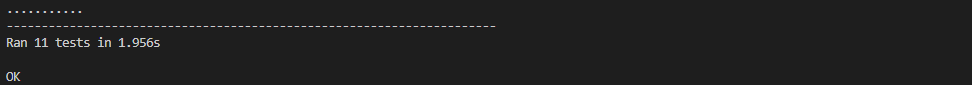

# Page View Time Series Visualizer

This is the boilerplate for the Page View Time Series Visualizer project. Instructions for building your project can be found at [freeCodeCamp.org](https://www.freecodecamp.org/learn/data-analysis-with-python/data-analysis-with-python-projects/page-view-time-series-visualizer)

---

## Detail

For this project you will visualize time series data using a **line chart**, **bar chart**, and **box plots**. You will use _Pandas_, _Matplotlib_, and _Seaborn_ to visualize a dataset containing the number of page views each day on the freeCodeCamp.org forum from 2016-05-09 to 2019-12-03. _The data visualizations will help you understand the patterns in visits and identify yearly and monthly growth._  

---

## Task

- [X] Import **fcc-forum-pageviews.csv**  
- [X] Set index as **date** column  
- [X] Clean data by filterling out day that page view  
  - [X] Page view over **Top 2.5%**  
  - [X] Page view lower **Bottom 2.5%**  
- [X] Draw line chart similar to "examples/Figure_1.png"
  - [X] Title "Daily freeCodeCamp Forum Page Views 5/2016-12/2019"  
  - [X] X label : Date  
  - [X] Y label : Page views  
 **Example**  
    
 **Result**
   

- [X] Draw bar chart similar to "examples/Figure_2.png"  
  - [X] Average page views for each month group by year  
  - [X] Legend show month labels with Title of Months  
  - [X] X label : Years  
  - [X] Y label : Average Page Views  
  - [X] Months legend  
 **Example**  
      
 **Result**  
   

- [X] Draw box plots similar to "examples/Figure_3.png"  
  - [X] 1st chart title : Year-wise Box Plot (Trend)  
  - [X] 2nd chart title : Month-wise Box Plot (Seasonality)  
  - [X] Months labels on bottom start at Jan  
  - [X] X1 label : Year
  - [X] X2 label : Months
  - [X] Y label : Page Views  
 **Example**  
      
 **Result**  
 

---

## Test result

Pass : 11 test  

